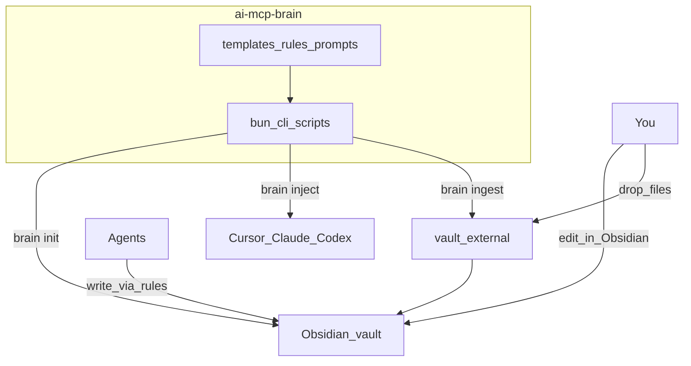

# Second Brain (Obsidian + Agent Harnesses)

## Decisions (locked)

- **Source of truth:** local Obsidian vault (markdown). You browse/edit in Obsidian; agents read/write via conventions + later MCP.
- **Writers:** agents (Cursor / Claude / Codex) update memory when they judge it useful; you also drop files into an `external/` inbox and can edit any note by hand.
- **This repo (`ai-mcp-brain`):** scaffolding scripts, prompts/rules templates, and injectors — not the vault itself. Vault path defaults to the Obsidian iCloud vault `…/Documents/My Brain` (override with `config.toml` or `BRAIN_VAULT`).
- **v1 scope:** structure + generate + inject rules. Agent “when to write” prompt craft and full MCP retrieval come next (discuss later).

## Architecture



## Vault layout (generated by `brain init`)

```
second-brain/
  inbox/           # agent + human quick captures
  external/        # drop zone for files you add (pdf/md/txt); ingest script promotes them
  projects/        # one folder or note per repo/product
  patterns/        # reusable TS/Next/Bun/AI patterns
  stack/           # tool notes (Vercel, Bun, AI SDK, etc.)
  media/           # distilled creator takeaways (Theo/Dax/Prime)
  agents/          # session learnings, orchestrator playbooks
  _meta/           # schema, tags, index stubs (for later retrieval)
  AGENTS.md        # short “how to use this vault” for any agent that can see the vault
```

Notes use light frontmatter (`type`, `project`, `tags`, `updated`) so later indexing is easy without forcing a heavy PKM system.

## This repo layout

```
ai-mcp-brain/
  package.json          # bun
  src/cli.ts            # brain init | inject | ingest
  templates/
    vault/              # folder tree + seed notes (README per folder)
    rules/
      cursor/           # .cursor/rules/*.mdc fragments
      claude/           # CLAUDE.md / .claude snippet
      codex/            # AGENTS.md / instructions snippet
    prompts/
      memory-write.md   # stub: when/how agents update memory (flesh out later)
  config.example.toml   # vault path, harness paths
```

## CLI (v1)

1. **`brain init [--path]`** — create vault dirs, seed notes, write `AGENTS.md` and `_meta/schema.md`. Idempotent (don’t clobber existing notes).
2. **`brain inject [--target cursor|claude|codex|all]`** — copy/merge rule snippets into local harness configs:
   - Cursor: project or global `.cursor/rules/second-brain.mdc` (and optional user rules path)
   - Claude Code: append/merge block into `CLAUDE.md` or `~/.claude/` convention
   - Codex: inject into `AGENTS.md` / instructions file at a configured path
   Rules tell agents: vault location, when to write, where to put notes (`inbox/` vs `projects/`), never invent facts, prefer append/update over duplicate.
3. **`brain ingest`** — move/process `external/` into typed notes under `inbox/` or `projects/` (v1: copy `.md` as-is with frontmatter; binary files get a stub note linking to the original).

## Rule injection content (v1, minimal)

Shared policy embedded in each harness:

- Memory lives at `$BRAIN_VAULT` (absolute path in injected rules).
- **Write** when: durable decision, new pattern, corrected misconception, project gotcha, user-stated preference.
- **Don’t write** when: ephemeral debug, secrets, one-off task noise.
- Prefer updating an existing linked note over creating duplicates.
- User drops go to `external/`; agents treat those as inputs after ingest (or read stubs).

Detailed prompt engineering for “efficient” memory discipline is deferred to a follow-up discussion.

## Out of v1 (explicitly later)

- Embeddings / graph index
- Auto-watch of `external/`
- Deep “when to remember” prompt tuning
- YouTube/media pipeline beyond a `media/` folder

## MCP tools (started)

Stdio server: `bun run mcp` → [`src/mcp/server.ts`](src/mcp/server.ts)

| Tool | Purpose |
|------|---------|
| `search_notes` | Keyword search across vault |
| `read_note` | Read note by relative path |
| `remember` | Create/append durable notes (`scope`: global \| project) |
| `get_project_context` | Ensure + load git-repo project pack |
| `list_recent` | Recent tools/skills log |
| `track_tool` | Catalog SaaS/tool + prepend recent |

Cursor example config: [`mcp.cursor.example.json`](mcp.cursor.example.json)

## Implementation order

1. Bun package + `config` + CLI stubs — **done**
2. Vault templates + `brain init` — **done** (My Brain iCloud path)
3. MCP tools (search / read / remember / project context) — **done** (stdio)
4. Rule templates + `brain inject` for Cursor, Claude, Codex — **done**
5. Project scope + tool radar — **done** (git-repo projects, catalog/recent, ask-on-doubt, `list_recent` / `track_tool`)
6. `brain ingest` for `external/`
7. Short repo README: init → Obsidian → MCP → inject → daily use

See also: [`plans/project-and-tools-memory.md`](plans/project-and-tools-memory.md)

## Success criteria

- One command creates an Obsidian-openable vault with the folders above.
- One command injects the same memory policy into the three harnesses.
- You can drop a file in `external/` and ingest it; you can edit any note in Obsidian; agents are instructed to write into the vault when warranted.

## Implementation todos

1. Bun package, config.example, CLI entry (init/inject/ingest)
2. Obsidian vault folder templates + seed notes + AGENTS.md
3. Implement idempotent `brain init`
4. Shared memory policy + Cursor/Claude/Codex rule snippets
5. Implement `brain inject`
6. Implement `external/` ingest
7. README for daily workflow
