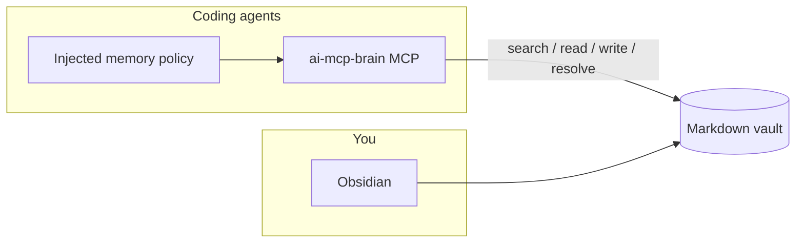

# How it works

## Mental model

Three layers:

1. **Vault** — Obsidian-compatible markdown. Source of truth for durable knowledge and process.
2. **MCP server (`ai-mcp-brain`)** — Structured read/write API for agents over stdio.
3. **Harness policy** — A short memory policy injected into Cursor / Claude / Codex / Zed so agents know when to search, resolve process, and write.

Humans and agents share the same files. Agents should not invent vault facts or process; they search and resolve first.

## Project = one git repository

Memory for application work is keyed to **git repos**, not product brands or monorepo package names.

- Folder: `projects/<slug>/`
- Default slug: git root folder name
- Optional overrides: documented in `_meta/projects-index.md` (agents should read and apply; MCP does not auto-resolve the index yet)

Each project pack includes at least:

| File | For |
|------|-----|
| `README.md` | Purpose, paths, focus |
| `decisions.md` | Append-only decisions |
| `tools.md` | Tools used in this repo |
| `gotchas.md` | Repo-specific pitfalls |

Optional overlays: `projects/<slug>/instructions|suggestions|workflows|actions/`.

## Global memory

Cross-repo knowledge lives outside project packs:

| Folder | Role |
|--------|------|
| `inbox/` | Unsorted captures |
| `external/` | Human file drops (ingest later) |
| `patterns/` | Cross-repo approaches |
| `stack/catalog/` | One note per tool/SaaS |
| `stack/recent.md` | Newest-first tools/skills log |
| `media/` | Distilled talk takeaways |
| `agents/` | Orchestrator / agent learnings |
| `instructions/` | Binding process |
| `suggestions/` | Soft standing prefs |
| `workflows/` | Playbooks and personas |
| `actions/` | Action → guidance registry |
| `work/` | Reserved vault area (internal / WIP surfaces) |
| `_meta/` | Schema and indexes |

## Process vs facts

| Kind | Where | How agents get it |
|------|-------|-------------------|
| Durable facts / decisions | `remember`, project packs, patterns, stack | `search_notes`, `read_note`, `get_project_context` |
| Soft prefs (“prefer…”) | `suggestions/` | Auto-log via `upsert_guidance`; loaded with actions |
| Binding rules (“must…”) | `instructions/` | Only when you mean hard process |
| Playbooks / personas | `workflows/` | `read_note` / `resolve_guidance` |
| Mode bundles (coding, PR, …) | `actions/registry.md` | `resolve_action` at **mode start** |

Project guidance **precedes** global for the same kind. Soft suggestions are prefer-not-must. Empty instruction bodies are normal — agents must not invent binding process.

## Runtime

- JS runtime: **Bun preferred**, or **Node.js 20+** via local `tsx`
- Vault path: `BRAIN_VAULT` overrides `config.toml` `vault_path`
- After MCP/schema changes in this repo: restart MCP (`scripts/restart-mcp.sh`); reload the editor if schemas still look stale

## Related

- [Vault & memory](features/vault-and-memory.md)
- [Guidance system](features/guidance.md)
- [Getting started](guides/getting-started.md)
- [MCP tools](reference/mcp-tools.md)
