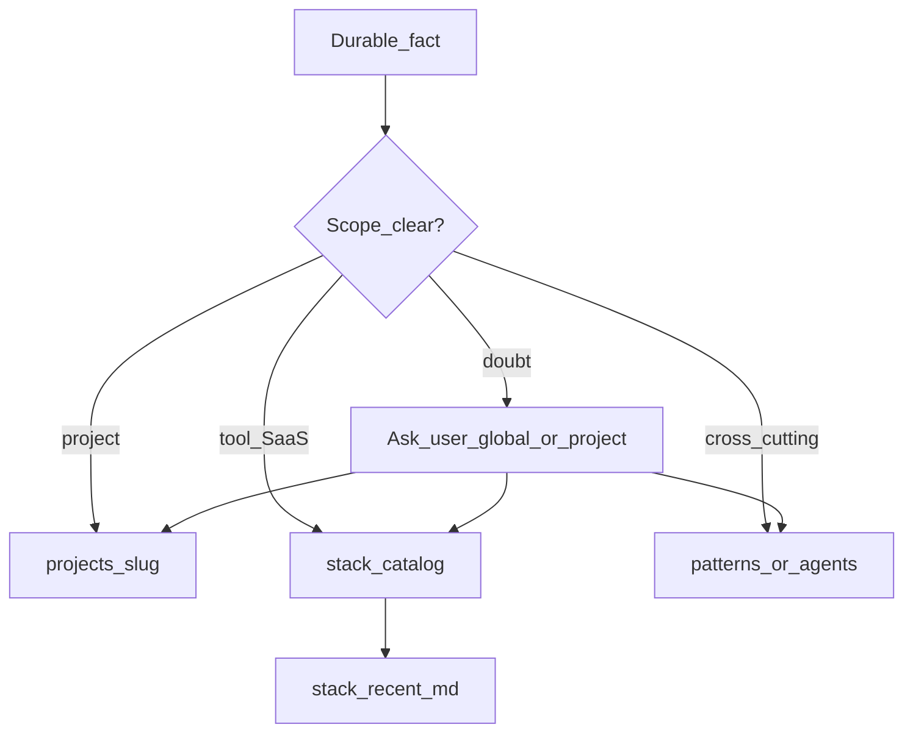

# Plan: Project-scoped knowledge + tool tracking

## Goals

- Remove stack bias (no default TS/Next/Bun/Vercel favoritism).
- Track **SaaS products and tools** you mention or use, including new ones you try.
- Keep a **running recent** memory of newly used/learned skills and tools.
- Isolate **project-level** decisions so they do not apply globally by accident.
- **When scope is unclear, ask** — do not guess global vs project.

## Scope model

| Scope | Meaning | Where |
|-------|---------|--------|
| **global** | Cross-cutting unless a repo overrides | `stack/`, `patterns/`, `media/`, `agents/`, `stack/recent.md` |
| **project** | One **git repository** only | `projects/<slug>/` |

**Project definition (locked):** a project is a **git repo**. Not a company, product name, or monorepo package unless that package is its own git repo. Agents resolve the current project from the git root of the working tree.

**Routing (locked):**

1. Clearly about **this git repo** → **project** (`projects/<slug>/`).
2. Clearly a tool/SaaS itself (catalog knowledge) → **global** `stack/catalog/` + prepend `stack/recent.md`.
3. Clearly cross-cutting pattern (user said “in general” / “always”) → **global** `patterns/` or `agents/`.
4. **When in doubt → ask the user:** “Should this go in global memory or project memory (`<slug>` / this git repo)?” Do not write until they choose (except a temporary `inbox/` capture if they say “park it”).

**Slug mapping (locked):** git repo root folder name by default; `_meta/projects-index.md` overrides (absolute path or remote URL → slug).



## Vault layout

```
stack/
  README.md
  recent.md                 # newest first; ~50 entries
  catalog/
    <tool-slug>.md          # one note per tool/SaaS
projects/
  README.md
  <slug>/
    README.md               # what it is
    decisions.md            # append-only, THIS project only
    tools.md                # tools/SaaS used in THIS project
    gotchas.md              # optional
_meta/
  projects-index.md         # path → slug overrides
  schema.md                 # add scope: global | project
```

## Prompt changes

Rewrite [`templates/prompts/agent-memory.md`](templates/prompts/agent-memory.md) + injected [`templates/prompts/memory-policy.md`](templates/prompts/memory-policy.md):

1. Neutral identity (engineer second brain — any stack).
2. **Tool radar** — serious use/discussion of a tool or SaaS: upsert catalog + prepend recent.
3. **Project isolation** — repo decisions → `projects/<slug>/` only.
4. **Ask on ambiguity** — if global vs project is unclear, ask before `remember`.
5. Start of work: `get_project_context(slug)` + skim recent when relevant.
6. Keep don’t-write rules (secrets, ephemeral debug, etc.).

Then `brain inject --target all`.

## MCP / code

- `remember`: `scope: global | project`; project writes under `projects/<slug>/`.
- `list_recent`: read rolling recent log.
- `get_project_context`: ensure `projects/<slug>/{README,decisions,tools}.md` exist.
- `brain init`: seed new templates idempotently into My Brain.

## Enforcement checklist

1. No favored stack in policy text.
2. Tool/SaaS seen → catalog + recent.
3. Project decision → that **git repo’s** folder only.
4. Global pattern only when clearly cross-repo.
5. **Doubt → ask global vs project (this git repo); do not assume.**
6. Recent = newest-first skills/tools memory.
7. Slug = index override or git root folder name.

## Out of scope (later)

- Embeddings / graph
- Auto-watch ingest
- Per-repo Cursor rule setting `BRAIN_PROJECT=slug`

## Build order

1. Vault templates + schema/index/recent/catalog/project skeleton
2. Prompt rewrite (including ask-on-doubt) + reinject
3. MCP helpers (`list_recent`, smarter remember/context)
4. `brain init` into My Brain + update root `PLAN.md`
